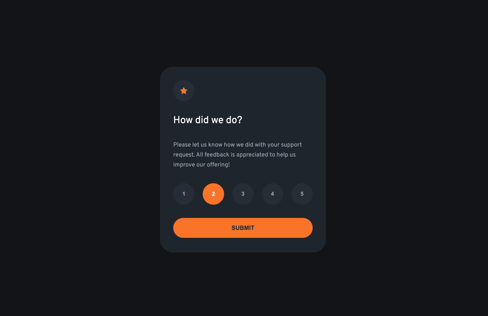
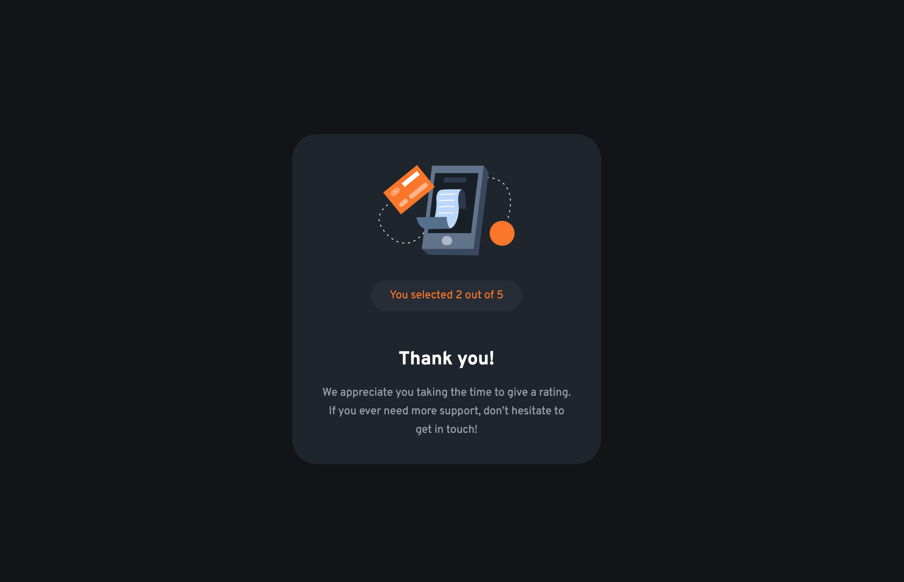

# Frontend Mentor - Interactive rating component solution

This is a solution to the [Interactive rating component challenge on Frontend Mentor](https://www.frontendmentor.io/challenges/interactive-rating-component-koxpeBUmI). Frontend Mentor challenges help you improve your coding skills by building realistic projects. 

## Table of contents

- [Overview](#overview)
  - [The challenge](#the-challenge)
  - [Screenshot](#screenshot)
  - [Links](#links)
- [My process](#my-process)
  - [Built with](#built-with)
  - [Useful resources](#useful-resources)
- [Author](#author)

## Overview

### The challenge

Users should be able to:

- View the optimal layout for the app depending on their device's screen size
- See hover states for all interactive elements on the page
- Select and submit a number rating
- See the "Thank you" card state after submitting a rating

### Screenshot

### Links

- Solution URL: [Solution URL](https://lordag.github.io/fm-12-interactive-rating-component/)

## My process

### Built with

- Semantic HTML5 markup
- CSS custom properties
- Flexbox
- CSS Grid
- Mobile-first workflow
- Javascript

### Useful resources

- [Aria states and properties](https://developer.mozilla.org/en-US/docs/Web/Accessibility/ARIA/Attributes) - This page lists reference pages covering all the WAI-ARIA attributes
- [WAI-ARIA roles](https://developer.mozilla.org/en-US/docs/Web/Accessibility/ARIA/Roles) - This page lists reference pages covering all WAI-ARIA roles

## Author

- Frontend Mentor - [@lordag](https://www.frontendmentor.io/profile/lordag)
